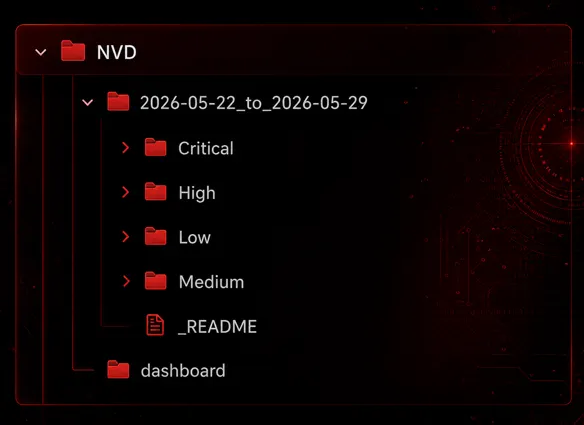
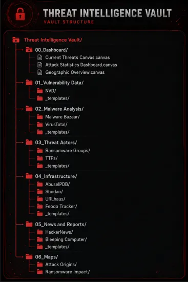

# NVD Scraper for Obsidian

A small Python script that pulls the latest CVEs from the [NIST National Vulnerability Database (NVD)](https://nvd.nist.gov/) and turns each one into a Markdown note inside your [Obsidian](https://obsidian.md/) vault, sorted by severity and ready for triage with Dataview.

Full write-up on Medium: [How to create a NVD Scraper within your Obsidian-Vault](https://medium.com/@xLuk3/how-to-create-a-nvd-scraper-within-your-obsidian-vault-65ab3b8b17ee)

## Features

- Fetches every CVE published in the last 7 days (configurable), following NVD pagination
- One note per CVE with CVSS score, vector, description, references and a triage checklist
- Notes are sorted into `Critical`, `High`, `Medium`, `Low` and `Unscored` folders
- Generates a Dataview dashboard and an Obsidian canvas
- Reads your API key and vault path from environment variables, so no secrets live in the code

## Requirements

- Python 3.8+
- [Obsidian](https://obsidian.md/) with the **Dataview** plugin
- A free [NVD API key](https://nvd.nist.gov/developers/request-an-api-key) (optional, but without it requests are heavily rate limited)

## Installation

```bash
git clone https://github.com/Luke1th/NVD_Scraper.git
cd NVD_Scraper
pip install -r requirements.txt
```

Only `requests` needs installing. `os`, `json`, `time`, `datetime` and `pathlib` are part of Python's standard library.

## Configuration

Set these environment variables before running the script.

| Variable | Required | Description |
|---|---|---|
| `OBSIDIAN_VAULT_PATH` | yes | Absolute path to your Obsidian vault |
| `NVD_API_KEY` | no | Your NVD API key |
| `NVD_DAYS_BACK` | no | Days to look back (default `7`) |

**Windows (PowerShell)**

```powershell
$env:OBSIDIAN_VAULT_PATH = "C:\Users\Bob\Obsidian"
$env:NVD_API_KEY = "your-api-key"
```

**Linux / macOS**

```bash
export OBSIDIAN_VAULT_PATH="$HOME/Obsidian"
export NVD_API_KEY="your-api-key"
```

> Never commit your API key. If a key has ever been published, request a new one from NVD.

## Usage

```bash
python nvd_scraper.py
```

The terminal shows each CVE as it is written. When it finishes, open your vault:



```
01_Vulnerability Data/NVD/
├── dashboard.md
└── 2026-05-22_to_2026-05-29/
    ├── _README.md
    ├── Critical/
    ├── High/
    ├── Medium/
    ├── Low/
    └── Unscored/
00_Dashboard/
└── Vulnerability_Intel.canvas
```

`Unscored` holds CVEs that NVD has not assigned a CVSS v3 score yet, which is common for brand-new entries.

## Suggested vault structure

The scraper writes into `01_Vulnerability Data/NVD`. The article suggests this layout for a wider threat intelligence vault:



### Required plugins

- **Templates**: standardized note creation
- **HTML Reader**: embedding external content
- **Dataview**: dynamic views and queries (needed by the dashboard)
- **Calendar**: temporal analysis
- **Maps**: geographic visualization
- **Canvas**: interactive dashboards

### Note templates

Ready-to-use templates are in [`templates/`](templates/):

- [`vulnerability.md`](templates/vulnerability.md)
- [`ransomware_group.md`](templates/ransomware_group.md)

### Dashboard ideas

Create a main canvas in `00_Dashboard` that includes:

- Latest threat intel
- Geographic distribution of threats
- Embedded attack maps
- Recent vulnerability counts
- Active ransomware groups

## Bonus: popular vulnerability databases

- [Exploit-DB](https://www.exploit-db.com/)
- [GitHub Advisories](https://github.com/advisories)
- [CISA Known Exploited Vulnerabilities Catalog](https://www.cisa.gov/known-exploited-vulnerabilities-catalog-print)

## Author

Written by [0xLuk3](https://medium.com/@xLuk3), cybersecurity researcher and bug bounty hunter.
